## Laporan Praktikum Basis Data - Pertemuan 1
**Nama** : Divva Ramadhan Puja Pratama

**NPM** : 25430077

**Kelas** : C

**Tanggal** : 08 Oktober 2026

**Dosen Pengampu** : Dedi Irawan, S.Kom., M.Kom.

## 1. Tujuan Praktikum
Praktikum ini bertujuan supaya bisa mengenal lingkungan kerja MariaDB menggunakan XAMPP dan Git. Di praktikum ini juga 
dipelajari cara menjalankan MariaDB,
masuk ke database lewat CLI dan phpMyAdmin, mengatur akun dan hak akses, serta menyimpan pekerjaan ke GitHub.

## 2. Ringkasan Dasar Teori
Basis data digunakan untuk menyimpan data supaya lebih teratur dan mudah dikelola. Untuk mengelolanya menggunakan MariaDB. 
MariaDB menggunakan sistem klien-server. 
Kita bisa mengaksesnya melalui mysql di Command Prompt atau menggunakan phpMyAdmin melalui browser. XAMPP digunakan untuk 
menjalankan MariaDB dengan lebih mudah 
melalui Control Panel. Di modul ini juga dibahas akun root, akun kerja, dan pemberian hak akses sesuai kebutuhan. Selain 
MariaDB, digunakan juga Git untuk mencatat p
erubahan pekerjaan dan menyimpan proyek ke GitHub.

## 3. Hasil Langkah Percobaan
### 3.1 Menjalankan layanan maria db
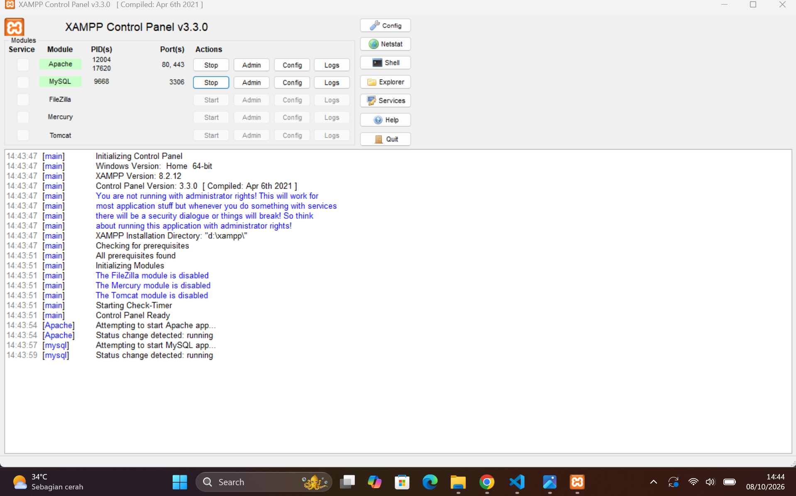

### 3.2 Login akun root
Login akun root dengan mysql -u root, dan jalankan SELECT VERSION(), CURRENT_USER(); untuk melihat versi.
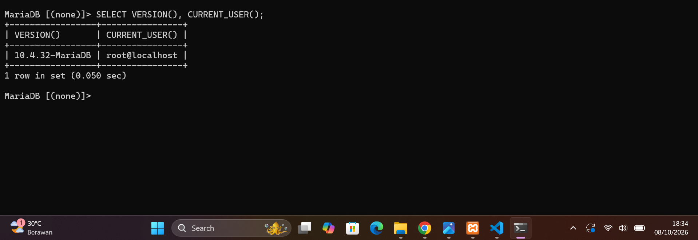

Hasil dari SELECT @@sql_mode;
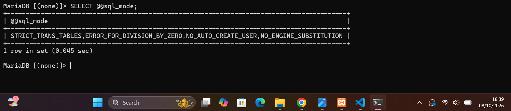

### 3.3  Hasil membuat password di Akun root
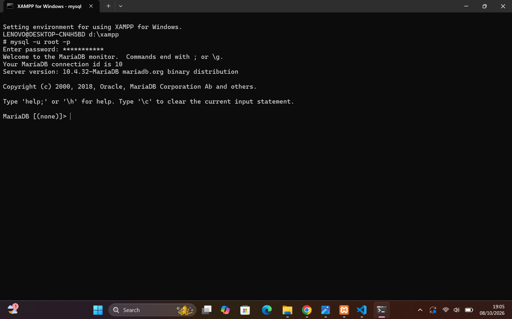

### 3.4  Login akun mhs dan show database.
hasil show database akun mhs
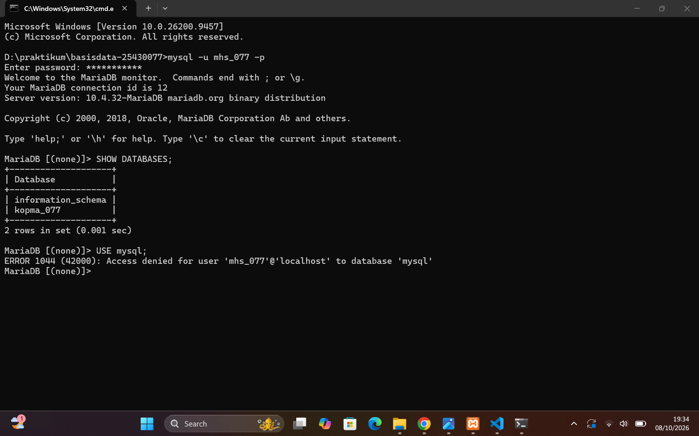

### 3.5 Login ke phpmyadmin
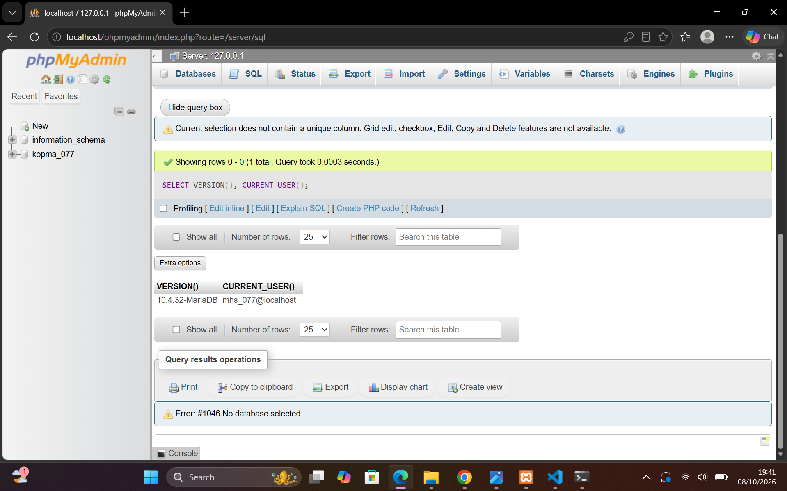

### 3.6 Menghubungkan folder kerja ke repository di Github dengan git
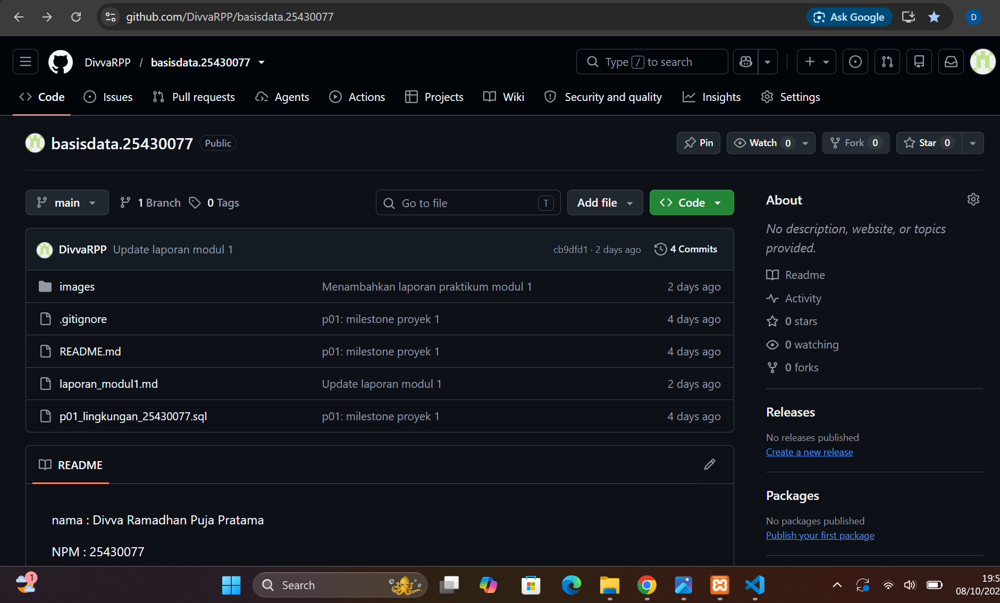

## 4. Jawaban Titik Analisis
### Titik Analisis 1
Walaupun tombol di XAMPP tertulis MySQL, server yang dipakai sebenarnya MariaDB. Dokumentasi MySQL masih bisa dipakai untuk hal 
umum
#### Titik Analisis 2
Login tanpa -p gagal karena root sudah diberi password. Jadi server menolak login karena password tidak dikirim.
### Titik Analisis 3
information_schema tetap terlihat karena database tersebut masih bisa diakses oleh akun mhs_123. Sedangkan database mysql 
ditolak karena akun tersebut tidak punya hak 
akses. 1044 berarti akses database ditolak, sedangkan 1045 berkaitan dengan login.
### Titik Analisis 4
Mode cookie lebih aman karena password tidak disimpan di file konfigurasi. Jadi password harus dimasukkan saat login ke phpMyAdmin

## 5. Hasil Latihan dan Modifikasi
### 5.1 Membuat akun tamu_077
Latihan ini membuat akun user tamu_077 dan mempunyai hak akses SELECT ke databse kopma_077
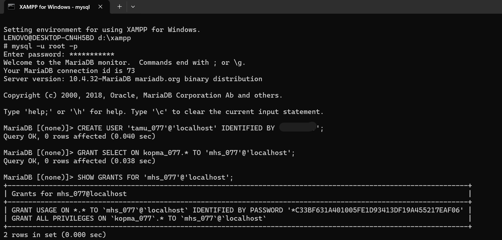

Hasil tes ketika akun tamu mencoba CREATE TABLE uji (id INT)
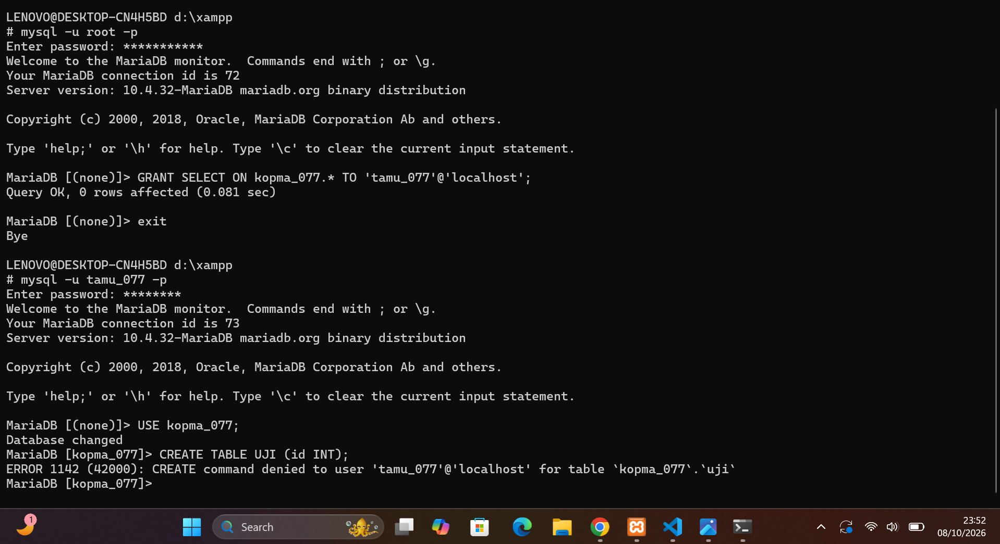
ERROR ini terjadi karena akun tamu_077 tidak mempunyai hak akses untuk membuat tabel kopma_077.

## 6. Tugas Mandiri: Milestone Proyek 1
Pada tahap ini saya mulai menyiapkan database dan akun untuk proyek. Saya juga mengisi README.md, membuat .gitignore, lalu melakukan commit dan push ke GitHub.

### 6.1 Membuat database dan akun berdasarkan tema
Membuat database perpus_077
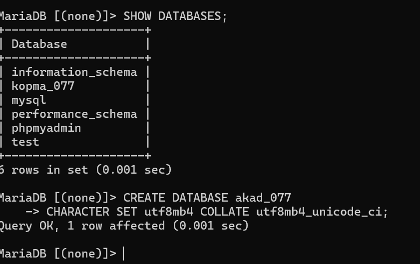

SHOW DATABASE PADA AKUN dev_077
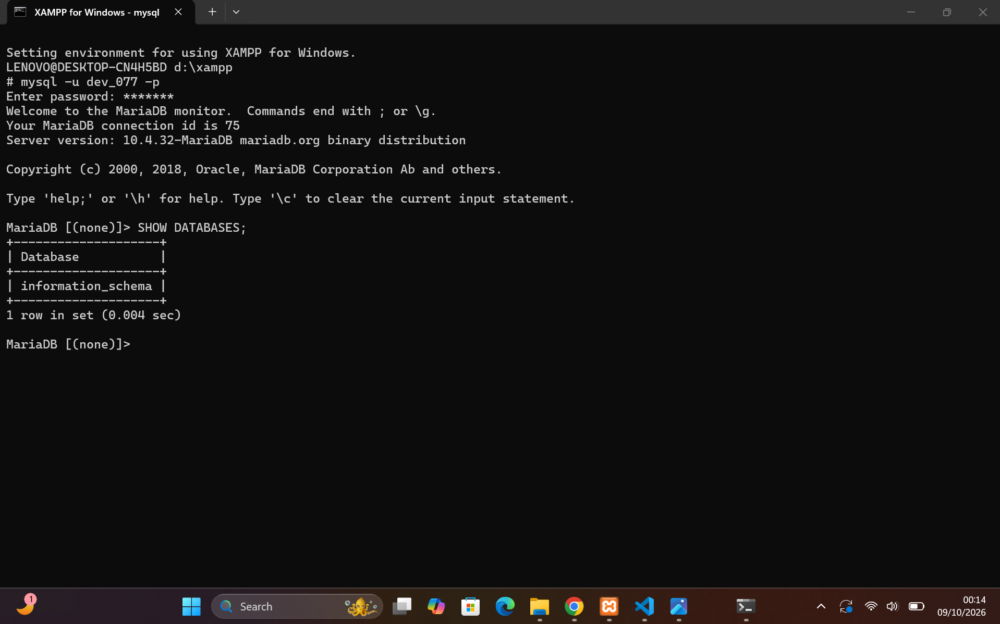

### 6.2 Menambahkan Identitas Proyek yang dibuat
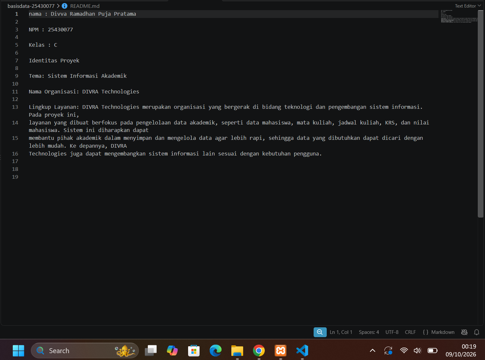

## 7. Pembahasan dan Kendala
Selama praktikum saya masih agak bingung saat mengatur hak aksesnya. Contohnya saat akun hanya diberi hak SELECT, Saya juga sempat bingung saat membuat akun yang tidak 
memiliki hak akses. Setelah dicoba beberapa kali,mengikuti panduan buku dan di bntu asisten AI akhirny berhasil.

## 8. Kesimpulan
Praktikum ini memberikan pemahaman tentang cara menjalankan MariaDB melalui XAMPP, menggunakan CLI dan phpMyAdmin, serta mengatur akun dan hak akses. Selain itu, 
dipahami juga penggunaan Git dan GitHub untuk menyimpan serta mengelola hasil praktikum.

## 9. Pernyataan Penggunaan AI
Saya menggunakan CHATgpt untuk membantu memahami materi dan juga bagaimana langkah yang harus dilakukan untuk menyelesaikan soalnya dan beberapa error. 
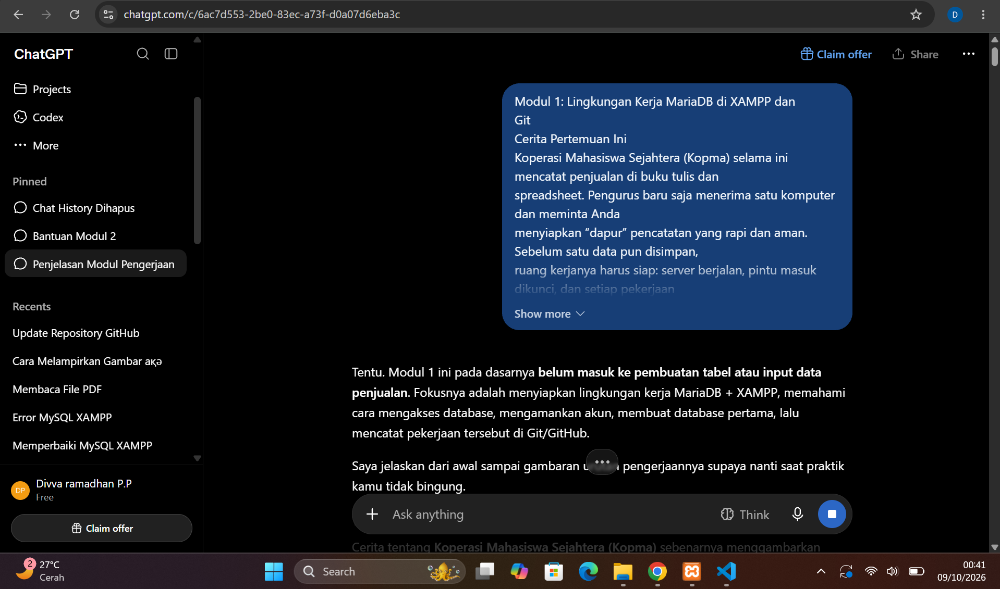

## 10. Bukti Git 
Tautan repository:https://github.com/DivvaRPP/basisdata.25430077
Hash commit: 

# CHECKLIST PRAKTIKUM

## A. Checklist Umum

| No. | Butir | Yang Harus Ada | Status |
|:---:|---|---|:---:|
| 1 | **Identitas** | Nama, NIM, kelas, pertemuan ke-N, tanggal pelaksanaan, nama asisten/dosen | ☑ |
| 2 | **Tujuan** | Tujuan praktikum ditulis ulang dengan bahasa sendiri (maksimal 5 baris) | ☑ |
| 3 | **Ringkasan Teori** | Pemahaman sendiri atas Dasar Teori, maksimal setengah halaman, tanpa menyalin buku | ☑ |
| 4 | **Langkah Percobaan (D)** | Tangkapan layar hasil langkah kunci sesuai checklist khusus, masing-masing diberi keterangan singkat | ☑ |
| 5 | **Titik Analisis** | Semua Titik Analisis dijawab lengkap dengan alasan, bukan sekadar ya/tidak | ☑ |
| 6 | **Latihan (E)** | Skrip/dokumen hasil latihan beserta bukti berjalan | ☑ |
| 7 | **Tugas Mandiri (F)** | Milestone proyek pertemuan ini: berkas, bukti, dan penjelasan keputusan desain | ☑ |
| 8 | **Pembahasan dan Kendala** | Galat yang ditemui, cara membacanya, dan cara mengatasinya | ☑ |
| 9 | **Kesimpulan** | Dua sampai empat kalimat dengan bahasa sendiri | ☑ |
| 10 | **Pernyataan Penggunaan AI** | Alat yang dipakai, untuk apa, dan bagian mana | ☑ |
| 11 | **Bukti Git** | Tautan repositori dan kode commit (hash) pertemuan ini dengan pesan `pNN: ...` | ☑ |
| 12 | **Keaslian** | Setiap tangkapan layar memperlihatkan akun ber-NIM dan jam sistem; nama objek memuat NIM/inisial | ☑ |

---

## B. Checklist Khusus Pertemuan 1

| No. | Jenis | Yang Harus Ada | Status |
|:---:|---|---|:---:|
| 1 | **Berkas Wajib** | `p01_lingkungan_<NIM>.sql` (dapat dijalankan ulang), `README.md` berisi Identitas Proyek, `.gitignore` | ☑ |
| 2 | **Bukti Tangkapan Layar** | `SELECT VERSION(), CURRENT_USER();` | ☑ |
| 3 | **Bukti Tangkapan Layar** | `SELECT @@sql_mode;` | ☑ |
| 4 | **Bukti Tangkapan Layar** | `SHOW DATABASES` sebagai `mhs_<3d>` | ☑ |
| 5 | **Bukti Tangkapan Layar** | `SHOW DATABASES` sebagai `dev_<3d>` | ☑ |
| 6 | **Bukti Tangkapan Layar** | Galat 1044 dan 1142 | ☑ |
| 7 | **Bukti Tangkapan Layar** | Halaman masuk phpMyAdmin dengan mode cookie | ☑ |
| 8 | **Bukti Tangkapan Layar** | `git push` pertama | ☑ |
| 9 | **Analisis Wajib** | Titik Analisis 1–4 | ☑ |
| 10 | **Analisis Wajib** | Perbedaan kode galat 1044, 1045, dan 1142 | ☑ |

---

